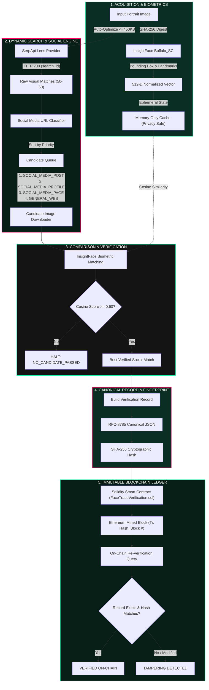

# 👁️‍🗨️ FaceTrace Ledger
### *AI Biometric Discovery, Social Media Provenance & Immutable Blockchain Verification Lab*

[](https://python.org)
[](https://fastapi.tiangolo.com)
[-61DAFB?style=for-the-badge&logo=react&logoColor=black)](https://reactjs.org)
[](https://tailwindcss.com)
[](https://soliditylang.org)
[](https://web3py.readthedocs.io)
[-00E599?style=for-the-badge&logo=pytest&logoColor=white)](https://pytest.org)
[](LICENSE)

> **FaceTrace Ledger** is an enterprise-grade biometric discovery, open-source intelligence (OSINT) provenance analysis, and tamper-evident cryptographic audit platform. It discovers public web and social media matches for facial evidence, prioritizes post-level provenance, fingerprints discoveries into canonical JSON records, and anchors mathematical proofs on an Ethereum smart contract—all while enforcing strict fail-fast safety and a zero-biometric on-chain privacy footprint.

---

## 📑 Table of Contents

- [1. Executive System Overview](#1-executive-system-overview)
- [2. High-Level Architecture & Data Flow](#2-high-level-architecture--data-flow)
- [3. Complete 7-Stage Forensic Pipeline](#3-complete-7-stage-forensic-pipeline)
  - [Stage 01: ACQUIRE — Evidence Ingestion & Binary Hashing](#stage-01-acquire--evidence-ingestion--binary-hashing)
  - [Stage 02: DETECT — Neural Face Detection & Alignment](#stage-02-detect--neural-face-detection--alignment)
  - [Stage 03: ENCODE — Ephemeral 512-D Biometric Embedding](#stage-03-encode--ephemeral-512-d-biometric-embedding)
  - [Stage 04: SEARCH — Google Lens Reverse Search with Auto-Optimization](#stage-04-search--google-lens-reverse-search-with-auto-optimization)
  - [Stage 05: COMPARE — Social Media Provenance & Candidate Verification](#stage-05-compare--social-media-provenance--candidate-verification)
  - [Stage 06: FINGERPRINT — RFC-8785 Canonical JSON Serialization](#stage-06-fingerprint--rfc-8785-canonical-json-serialization)
  - [Stage 07: LEDGER — Immutable Smart Contract Registration & Re-Verification](#stage-07-ledger--immutable-smart-contract-registration--re-verification)
- [4. Fail-Fast Pipeline Failure Handling & State Machine](#4-fail-fast-pipeline-failure-handling--state-machine)
  - [Execution Invariant](#execution-invariant)
  - [State Machine Transitions](#state-machine-transitions)
  - [Failure Modal & User Actions](#failure-modal--user-actions)
  - [Async Stale Request Protection](#async-stale-request-protection)
- [5. Interactive Full-Stack User Experience](#5-interactive-full-stack-user-experience)
- [6. Tamper Detection Sandbox & Cryptographic Proof](#6-tamper-detection-sandbox--cryptographic-proof)
- [7. Repository Structure](#7-repository-structure)
- [8. Quickstart & Installation](#8-quickstart--installation)
- [9. REST & SSE API Reference](#9-rest--sse-api-reference)
- [10. Automated Verification & Testing](#10-automated-verification--testing)
- [11. Privacy, Ethics & Security Considerations](#11-privacy-ethics--security-considerations)
- [12. Known Limitations & Maintenance](#12-known-limitations--maintenance)

---

## 1. Executive System Overview

In digital forensics, intellectual property protection, and biometric auditability, identifying whether a portrait image appears publicly on the web while proving provenance without violating subject privacy has historically been a critical challenge.

```text
       ┌──────────────────┐               ┌───────────────────┐               ┌──────────────────┐
       │   INPUT IMAGE    │ ────────────> │  BIOMETRIC SEARCH │ ────────────> │ CANONICAL RECORD │
       │ (User Upload/CV) │               │   & VERIFICATION  │               │   (RFC-8785 JSON)│
       └──────────────────┘               └───────────────────┘               └─────────┬────────┘
                                                                                        │
                                                                                        ▼
       ┌──────────────────┐               ┌───────────────────┐               ┌──────────────────┐
       │ TAMPER DETECTION │ <──────────── │  RE-VERIFICATION  │ <──────────── │ BLOCKCHAIN MINED │
       │ (Hash Mismatch)  │               │ (On-Chain Lookup) │               │ (Smart Contract) │
       └──────────────────┘               └───────────────────┘               └──────────────────┘
```

### ✨ Key Innovations

1. **Genuine Dynamic Reverse Search**: No hardcoded mocks. Uploaded photos are dynamically optimized in-memory and queried against Google Lens via SerpApi.
2. **Post-Level Social Media Classification & Prioritization**: Differentiates `SOCIAL_MEDIA_POST`, `SOCIAL_MEDIA_PROFILE`, `SOCIAL_MEDIA_PAGE`, and `GENERAL_WEB_RESULT` across 9 platforms (Instagram, X/Twitter, Reddit, TikTok, LinkedIn, Pinterest, Facebook, Threads, YouTube), prioritizing actual social posts for verification.
3. **Zero-Biometric On-Chain Footprint**: Biometric vectors and facial images are **never stored on the blockchain or persisted in public databases**. Only deterministic SHA-256 digests of structured provenance records are anchored on-chain.
4. **Mathematical Tamper Evidence**: Changing a single comma, URL, social platform tag, or similarity score alters the canonical SHA-256 fingerprint and causes immediate on-chain verification failure.
5. **Fail-Fast State Machine**: Any stage failure immediately halts execution, blocks all downstream processing, renders an actionable failure modal, and supports instantaneous process termination or fresh restart.
6. **Production-Ready Full-Stack Experience**: High-contrast editorial UI with live Server-Sent Events (SSE), Stop Execution, Restart Execution, Reset to New Investigation, Tamper Simulator, and Forensic PDF/JSON exports.

---

## 2. High-Level Architecture & Data Flow



---

## 3. Complete 7-Stage Forensic Pipeline

### Stage 01: ACQUIRE — Evidence Ingestion & Binary Hashing
- **Input**: User-uploaded image binary (JPG, PNG, WebP) or pre-flight sample portrait.
- **Processing**: Validates file integrity, determines dimensions, and calculates the SHA-256 cryptographic checksum (NIST FIPS 180-4) of the raw binary.
- **Output**: `image_sha256`, `filename`, `image_url`.
- **Fail Condition**: File missing, corrupt binary, or unreadable headers.

### Stage 02: DETECT — Neural Face Detection & Alignment
- **Model**: InsightFace `buffalo_sc` (500M ResNet detection backbone) with OpenCV cascade fallback.
- **Processing**: Identifies primary facial bounding box `[x1, y1, x2, y2]`, detection confidence score, and 5-point facial landmarks (left eye, right eye, nose tip, left mouth, right mouth).
- **Output**: `bbox`, `confidence`, aligned face crop.
- **Fail Condition**: Zero recognizable facial landmarks detected in the frame.

### Stage 03: ENCODE — Ephemeral 512-D Biometric Embedding
- **Backbone**: MobileFaceNet `w600k_mbf.onnx`.
- **Processing**: Computes a 512-dimensional normalized unit vector ($L_2$ norm $\|v\|_2 = 1.0$) from the aligned face crop.
- **Zero-Persistence Guarantee**: The embedding vector exists solely in volatile process memory during pipeline execution. It is never written to disk, never logged to terminal output, and never submitted on-chain.
- **Output**: `embedding_dimension: 512`, `ephemeral: true`.

### Stage 04: SEARCH — Google Lens Reverse Search with Auto-Optimization
- **In-Memory Optimization**: Automatically resizes and compresses high-resolution photos (2MB–10MB) to <450KB and max 1000px in-memory without losing facial fidelity (satisfying SerpApi ceilings).
- **Execution**: Queries Google Lens visual index via SerpApi, retrieving up to 60 candidate matches.
- **Output**: Parsed candidate URLs, titles, thumbnails, source domains, and social media tags.
- **Fail Condition**: Network timeout, invalid API credentials, rate-limit exhaustion, or zero web matches returned.

```text
+-----------------------------------------------------------------------------------+
| [SEARCH] [search_20260902_43faae] Preparing reverse-image request                 |
| [SEARCH] Image optimized: 2589.6 KB -> 14.6 KB (531x396 px, Q=25)                 |
| [SEARCH] Provider: SerpApi | Engine: Google Lens                                  |
| [SEARCH] Request sent -> HTTP 200 OK                                              |
| [SEARCH] Results parsed: 60 visual matches (16 social media candidates)           |
+-----------------------------------------------------------------------------------+
```

### Stage 05: COMPARE — Social Media Provenance & Candidate Verification
The system classifies candidate URLs across 9 major platforms:

| Platform | Domain Identifier | Post Regex / Identifier | Result Type |
| :--- | :--- | :--- | :--- |
| **Instagram** | `instagram.com` | `/p/`, `/reel/`, `/reels/`, `/tv/` | `SOCIAL_MEDIA_POST` |
| **X (Twitter)** | `x.com`, `twitter.com` | `/[user]/status/[id]` | `SOCIAL_MEDIA_POST` |
| **Reddit** | `reddit.com` | `/r/[sub]/comments/[id]/...` | `SOCIAL_MEDIA_POST` |
| **TikTok** | `tiktok.com` | `/@ [user]/video/[id]` | `SOCIAL_MEDIA_POST` |
| **LinkedIn** | `linkedin.com` | `/posts/`, `/feed/update/`, `/pulse/` | `SOCIAL_MEDIA_POST` |
| **Pinterest** | `pinterest.com` | `/pin/[id]/` | `SOCIAL_MEDIA_POST` |
| **Facebook** | `facebook.com` | `/posts/`, `/photo.php`, `/permalink.php` | `SOCIAL_MEDIA_POST` |
| **Threads** | `threads.net` | `/@ [user]/post/[id]` | `SOCIAL_MEDIA_POST` |
| **YouTube** | `youtube.com` | `/watch?v=...`, `/shorts/...` | `SOCIAL_MEDIA_POST` |

#### Candidate Prioritization Queue
Candidate URLs are sorted with strict provenance hierarchy:
$$\text{Priority } 1: \text{SOCIAL\_MEDIA\_POST} \longrightarrow \text{Priority } 2: \text{SOCIAL\_MEDIA\_PROFILE} \longrightarrow \text{Priority } 3: \text{SOCIAL\_MEDIA\_PAGE} \longrightarrow \text{Priority } 4: \text{GENERAL\_WEB\_RESULT}$$

Each candidate thumbnail is downloaded safely, faces are detected and aligned, and Cosine Similarity is evaluated:
$$\text{Similarity}(u, v) = \frac{u \cdot v}{\|u\|_2 \|v\|_2} \ge 0.60$$

- **Fail Condition**: No candidate reaches the configured comparison threshold (`0.60`).

### Stage 06: FINGERPRINT — RFC-8785 Canonical JSON Serialization
When a candidate match passes verification, a canonical verification record is generated:

```json
{
  "candidate_image_sha256": "232703645b370c8eb5456c2befc126f95fb3aa3da338914faa020ac44c49bf8e",
  "image_sha256": "7de7ed51a1594fff247f4cae2301eceacf5313d6011e37b4a4c8733f7bb72c07",
  "is_social_media": true,
  "record_version": "1.0",
  "result_title": "lena.jpg now : r/programming",
  "result_type": "SOCIAL_MEDIA_POST",
  "search_provider": "serpapi_lens",
  "similarity_score": 0.9378,
  "similarity_threshold": 0.60,
  "social_platform": "reddit",
  "source_domain": "reddit.com",
  "source_url": "https://www.reddit.com/r/programming/comments/dobz8s/lenajpg_now/",
  "verified_at": "2026-09-02T06:26:22.486015+00:00"
}
```

- **Deterministic Serialization**: Keys are sorted alphabetically with RFC-8785 compliant canonical separators (`:`, `,`) and UTF-8 encoding.
- **SHA-256 Digest**: Generates a 64-character hexadecimal digest representing the immutable mathematical fingerprint of the discovery.

### Stage 07: LEDGER — Immutable Smart Contract Registration & Re-Verification
The 64-character hash is formatted as `bytes32` and submitted to the Solidity smart contract:

```solidity
// SPDX-License-Identifier: MIT
pragma solidity ^0.8.20;

contract FaceTraceVerification {
    struct VerificationRecord {
        bytes32 recordHash;
        uint256 timestamp;
        address submitter;
        bool exists;
    }

    mapping(bytes32 => VerificationRecord) public records;
    bytes32[] public allRecordHashes;

    event RecordRegistered(bytes32 indexed recordHash, address indexed submitter, uint256 timestamp);

    function registerRecord(bytes32 _recordHash) external returns (bool) {
        require(_recordHash != bytes32(0), "Invalid zero hash");
        require(!records[_recordHash].exists, "Record hash already registered");

        records[_recordHash] = VerificationRecord({
            recordHash: _recordHash,
            timestamp: block.timestamp,
            submitter: msg.sender,
            exists: true
        });

        allRecordHashes.push(_recordHash);
        emit RecordRegistered(_recordHash, msg.sender, block.timestamp);
        return true;
    }

    function verifyRecord(bytes32 _recordHash) external view returns (bool exists, uint256 timestamp, address submitter) {
        VerificationRecord memory rec = records[_recordHash];
        return (rec.exists, rec.timestamp, rec.submitter);
    }
}
```

- **On-Chain Re-Verification**: Queries the contract directly to verify that `recordHash` exists, comparing the stored block timestamp and submitter address against local forensic metadata.

---

## 4. Fail-Fast Pipeline Failure Handling & State Machine

### Execution Invariant
The system enforces the strict absolute invariant:
> **"No stage after a failed stage may execute under any circumstances."**

```text
               ANY STAGE FAILS
                      ↓
          IMMEDIATELY HALT EXECUTION
                      ↓
          BLOCK ALL DOWNSTREAM STAGES
                      ↓
             SHOW FAILURE POPUP
                      ↓
               USER CHOOSES:
         ├── [ TERMINATE PROCESS ]  ──> Returns to clean Homepage
         └── [ START NEW PROCESS ]  ──> Resets for fresh execution
```

### State Machine Transitions

| Entity | Allowed States | Transition Rules |
| :--- | :--- | :--- |
| **Stage** | `IDLE`, `PROCESSING`, `SUCCESS`, `FAILED`, `BLOCKED`, `CANCELLED` | `PROCESSING` $\to$ `SUCCESS` \| `FAILED` \| `CANCELLED`<br>`FAILED` $\to$ Downstream stages $\to$ `BLOCKED` |
| **Pipeline** | `IDLE`, `RUNNING`, `FAILED`, `HALTED`, `TERMINATED`, `COMPLETED` | `RUNNING` $\to$ `COMPLETED` (if all 7 succeed)<br>`RUNNING` $\to$ `HALTED` (if any stage fails)<br>`RUNNING` $\to$ `TERMINATED` (if cancelled/stopped) |

### Failure Modal & User Actions

When any stage fails, the application immediately activates a prominent modal dialog matching the platform's neo-brutalist theme:

```text
+-----------------------------------------------------------------------------------+
|  [!] PIPELINE EXECUTION HALTED                                                    |
|                                                                                   |
|  FAILED STAGE:       05 — COMPARE                                                 |
|  STATUS:             FAILED                                                       |
|  REASON:             No candidate passed the configured comparison threshold.    |
|  DETAILS:            60 candidates were returned by SEARCH, but none met the      |
|                      configured comparison threshold (0.60).                      |
|  DOWNSTREAM STAGES:  06 — FINGERPRINT: BLOCKED                                    |
|                      07 — LEDGER: BLOCKED                                         |
|  EXECUTION:          HALTED                                                       |
|  EXECUTION ID:       c48e89f2-7104-4df1-8659-1e1b7829910d                         |
|                                                                                   |
|  [ ✕ DISMISS ]     [ TERMINATE PROCESS ]     [ START NEW PROCESS ]                |
+-----------------------------------------------------------------------------------+
```

- **`[ TERMINATE PROCESS ]`**:
  - Immediately aborts active network requests/tasks.
  - Clears uploaded file, previews, stages, and result state.
  - Returns the user directly to the clean initial homepage.
  - Re-enables the standard image upload zone.
- **`[ START NEW PROCESS ]`**:
  - Invalidates the previous execution context.
  - Resets all 7 stages to `IDLE`.
  - Clears previous errors, candidate results, and temporary data.
  - Prepares the application for a fresh evidence trace.

### Async Stale Request Protection
Every trace execution generates a distinct `job_id` UUID. All incoming SSE messages, HTTP responses, and background promise callbacks check that `response.job_id === activeJobId`. Stale responses from terminated or reset jobs are strictly discarded and cannot alter UI state or re-open modals.

---

## 5. Interactive Full-Stack User Experience

The web interface is built using **React 18 + TypeScript + Vite + Tailwind CSS v4** adhering to the high-contrast Hacker House Goa brutalist aesthetic (*Forest Green `#0A2E23`, Warm Cream `#F5F0E3`, Hot Pink `#F50064`, Charcoal `#141414`*).

```text
+---------------------------------------------------------------------------------------+
|  FACETRACE LEDGER  //  AI BIOMETRIC DISCOVERY & BLOCKCHAIN VERIFICATION LAB           |
+---------------------------------------------------------------------------------------+
|                                                                                       |
|  [ 01 ACQUIRE ] ──> [ 02 DETECT ] ──> [ 03 ENCODE ] ──> [ 04 SEARCH ]                  |
|  [ 05 COMPARE ] ──> [ 06 FINGERPRINT ] ──> [ 07 LEDGER ]                              |
|                                                                                       |
|  CONTROLS:  [ STOP EXECUTION ]   [ RESTART TRACE ]   [ NEW IMAGE ]                    |
|                                                                                       |
|  ===================================================================================  |
|  [A] INPUT SUBJECT ARTIFACT            |  [B] DISCOVERED REDDIT POST MATCH            |
|  Image: lena.jpg                       |  Platform: REDDIT | Result: SOCIAL_MEDIA_POST|
|  SHA-256: 7de7ed51...                  |  Title: lena.jpg now : r/programming         |
|  Face: 512-D Normalized Vector         |  Similarity: 93.78% (Threshold: 60.0%)       |
|  ===================================================================================  |
|                                                                                       |
|  BLOCKCHAIN STATE:                                                                    |
|  Status: VERIFIED ON-CHAIN             |  Smart Contract: 0x5b1869...                 |
|  Block: #1                             |  Tx Hash: 0x15105fcad...                     |
|                                                                                       |
|  EXPORT CENTER:   [ EXPORT PDF CERTIFICATE ]   [ EXPORT JSON PACKAGE ]                |
+---------------------------------------------------------------------------------------+
```

### Interactive Components

1. **Live Forensic Stage Monitor**: Real-time visual progress showing pulse animations for `PROCESSING`, checkmarks for `SUCCESS`, alert tags for `FAILED`, and muted indicators for `BLOCKED`.
2. **Side-by-Side Face Comparison**: Renders input face crop alongside candidate face crop with an interactive similarity meter and visual threshold marker.
3. **Discovered Candidates Gallery**: Displays all evaluated web candidate thumbnails with social media badges, source domains, landing page links, and individual similarity scores.
4. **On-Chain Re-Verification Panel**: Direct RPC contract reader showing block number, timestamp, smart contract address, and submitter address.
5. **Tamper Testing Sandbox**: Interactive sandbox allowing user mutation of record attributes to demonstrate instant mathematical rejection on-chain.
6. **Forensic Export Center**: One-click generation of court-ready PDF audit certificates (with SHA-256 stamps) and raw JSON forensic bundles.
7. **History Drawer**: Local persistence of the 20 most recent trace investigations.

---

## 6. Tamper Detection Sandbox & Cryptographic Proof

```text
                               ┌────────────────────────────────┐
                               │ Original Record:               │
                               │ social_platform = "reddit"     │
                               │ Hash: 51e9de61...              │
                               └───────────────┬────────────────┘
                                               │
                                       (Altered to "x")
                                               │
                                               ▼
                               ┌────────────────────────────────┐
                               │ Tampered Record:               │
                               │ social_platform = "x"          │
                               │ Hash: 67823d59...              │
                               └───────────────┬────────────────┘
                                               │
                                      (Smart Contract Lookup)
                                               │
                                               ▼
                            ╔═══════════════════════════════════════╗
                            ║ [FAILED] HASH_MISMATCH                ║
                            ║ SECURITY ALERT: DATA HAS BEEN TAMPERED║
                            ╚═══════════════════════════════════════╝
```

1. **Deterministic Dependency**: The SHA-256 digest is calculated directly from the RFC-8785 canonical representation of the entire record.
2. **Avalanche Effect**: Modifying even a single character in the source URL, title, platform, or similarity score completely changes the output hash.
3. **On-Chain Immutability**: Because the smart contract stores only the pre-image hash at mining time, any lookup with a mutated record hash returns `exists = false`.

---

## 7. Repository Structure

```text
FaceTrace-Ledger/
├── data/
│   ├── candidates/                # Local cache of evaluated candidate thumbnails
│   ├── input/                     # Uploaded and pre-flight benchmark portraits
│   └── results/                   # Serialized verification records and exports
├── frontend/
│   ├── src/
│   │   ├── components/            # React UI components
│   │   │   ├── BlockchainRecord.tsx
│   │   │   ├── CandidateComparison.tsx
│   │   │   ├── ExportCenter.tsx
│   │   │   ├── FaceDetectionResult.tsx
│   │   │   ├── Header.tsx
│   │   │   ├── Hero.tsx
│   │   │   ├── HistoryDrawer.tsx
│   │   │   ├── HowItWorksModal.tsx
│   │   │   ├── ImageUploader.tsx
│   │   │   ├── PipelineFailureModal.tsx  # Fail-fast failure popup
│   │   │   ├── PipelineProgress.tsx      # Stage progress monitor
│   │   │   ├── SearchResults.tsx
│   │   │   ├── TamperTest.tsx            # Tamper simulation sandbox
│   │   │   └── VerificationPanel.tsx
│   │   ├── hooks/
│   │   │   └── usePipeline.ts     # Orchestration & state machine hook
│   │   ├── services/
│   │   │   └── api.ts             # REST & SSE client services
│   │   ├── types/
│   │   │   └── pipeline.ts        # TypeScript data contracts & interfaces
│   │   ├── utils/
│   │   │   ├── exportJson.ts
│   │   │   └── exportPdf.ts
│   │   ├── App.tsx
│   │   ├── index.css
│   │   └── main.tsx
│   ├── package.json
│   └── vite.config.ts
├── src/
│   ├── api/
│   │   └── server.py              # FastAPI application & SSE pipeline runner
│   ├── blockchain/
│   │   ├── client.py              # Web3.py & Py-EVM execution engine
│   │   ├── uploader.py            # Smart contract transaction manager
│   │   └── verifier.py            # On-chain state verifier
│   ├── contracts/
│   │   └── FaceTraceVerification.sol # Solidity smart contract
│   ├── crypto/
│   │   └── hashing.py             # SHA-256 & bytes32 conversions
│   ├── face/
│   │   ├── detector.py            # InsightFace neural detector & cascade fallback
│   │   ├── encoder.py             # MobileFaceNet 512-d embedding extractor
│   │   └── matcher.py             # Cosine similarity matching engine
│   ├── record/
│   │   ├── canonicalizer.py       # RFC-8785 JSON canonicalizer
│   │   └── metadata_builder.py    # Forensic verification record builder
│   ├── search/
│   │   ├── candidate_downloader.py# Safe thumbnail acquisition
│   │   ├── candidate_verifier.py  # Prioritization & multi-face verification
│   │   ├── result_parser.py       # Social media URL classifier (9 platforms)
│   │   ├── reverse_search.py      # Abstract search orchestration
│   │   └── providers/
│   │       ├── base.py
│   │       ├── factory.py
│   │       └── serpapi_lens.py    # Google Lens API provider with auto-compression
│   ├── utils/
│   │   ├── helpers.py
│   │   └── logger.py
│   └── config.py                  # Pydantic environment configuration
├── tests/                         # Comprehensive pytest test suite (47 tests)
│   ├── test_blockchain.py
│   ├── test_face.py
│   ├── test_hashing.py
│   ├── test_pipeline_e2e.py
│   ├── test_record.py
│   ├── test_search.py
│   ├── test_serpapi_robustness.py
│   └── test_social_media_classification.py
├── pytest.ini
├── requirements.txt
├── start.bat                      # Windows unified startup script
└── start.py                       # Cross-platform single-command runner
```

---

## 8. Quickstart & Installation

### Prerequisites
- **Python**: Version 3.11, 3.12, or 3.14
- **Node.js**: Version 18+ and npm
- **SerpApi Key**: For live Google Lens visual queries (optional for local mock testing)

### 1. Clone & Configure
```bash
git clone https://github.com/UltraV1be/FaceTrace-Ledger.git
cd FaceTrace-Ledger
```

Create a `.env` file in the project root:
```env
SERPAPI_KEY=your_serpapi_key_here
REVERSE_SEARCH_PROVIDER=serpapi_lens
FACE_MATCH_THRESHOLD=0.60
ENVIRONMENT=development
```

### 2. Single-Command Launch (Recommended)
Launch both backend and frontend concurrently with a single command:

**Cross-Platform (Python):**
```bash
python start.py
```

**Windows Batch:**
```cmd
start.bat
```

**npm Script:**
```bash
npm start
```

### 3. Manual Startup

**Backend Server:**
```bash
pip install -r requirements.txt
uvicorn src.api.server:app --host 127.0.0.1 --port 8000 --reload
```

**Frontend Dev Server:**
```bash
cd frontend
npm install
npm run dev
```

Open your browser at `http://localhost:5173`.

---

## 9. REST & SSE API Reference

### Health & Diagnostics
- `GET /api/health`: System health, component status, and masked search provider status.
- `GET /api/search-diagnostics`: Live Google Lens provider diagnostic connectivity check.
- `GET /api/sample-images`: List of pre-flight benchmark portraits in `data/input/`.

### Trace Orchestration
- `POST /api/upload`: Multipart image upload or sample name selector. Starts background pipeline and returns `{"job_id": "<uuid>"}`.
- `GET /api/pipeline-events/{job_id}`: Server-Sent Events (SSE) telemetry stream emitting real-time stage events.
- `GET /api/pipeline-result/{job_id}`: Fetches complete forensic JSON payload upon completion or failure.
- `POST /api/pipeline-cancel/{job_id}`: Halts execution of an active job.
- `POST /api/pipeline-restart/{job_id}`: Re-executes the pipeline with the existing image in a fresh job context.

---

## 10. Automated Verification & Testing

The repository includes a comprehensive automated test suite covering all modules:

```bash
pytest -v
```

### Test Suite Results

```text
============================= test session starts =============================
platform win32 -- Python 3.14.5, pytest-9.1.1, pluggy-1.6.0
collected 47 items

tests/test_blockchain.py::test_blockchain_register_and_verify PASSED     [  2%]
tests/test_blockchain.py::test_blockchain_tamper_detection PASSED        [  4%]
tests/test_blockchain.py::test_blockchain_duplicate_registration_rejection PASSED [  6%]
tests/test_face.py::test_cosine_similarity_identical PASSED              [  8%]
tests/test_face.py::test_cosine_similarity_orthogonal PASSED             [ 10%]
tests/test_face.py::test_face_matcher_threshold PASSED                   [ 12%]
tests/test_face.py::test_invalid_image_load PASSED                       [ 14%]
tests/test_face.py::test_face_encoding_dimension PASSED                  [ 17%]
tests/test_hashing.py::test_hash_string_deterministic PASSED             [ 19%]
tests/test_hashing.py::test_hash_string_collision_resistance PASSED      [ 21%]
tests/test_hashing.py::test_hash_record_deterministic PASSED             [ 23%]
tests/test_hashing.py::test_hash_record_tamper_detection PASSED          [ 25%]
tests/test_hashing.py::test_bytes32_conversion_roundtrip PASSED          [ 27%]
tests/test_hashing.py::test_bytes32_conversion_with_0x_prefix PASSED     [ 29%]
tests/test_hashing.py::test_bytes32_conversion_invalid_length PASSED     [ 31%]
tests/test_pipeline_e2e.py::test_full_pipeline_end_to_end PASSED         [ 34%]
tests/test_record.py::test_canonicalize_reordered_keys PASSED            [ 36%]
tests/test_record.py::test_build_verification_record_valid PASSED        [ 38%]
tests/test_record.py::test_build_verification_record_invalid_sha256 PASSED [ 40%]
tests/test_search.py::test_url_validation PASSED                         [ 42%]
tests/test_search.py::test_domain_extraction PASSED                      [ 44%]
tests/test_search.py::test_parse_search_results_deduplication PASSED     [ 46%]
tests/test_search.py::test_provider_factory_registration PASSED          [ 48%]
tests/test_serpapi_robustness.py::TestSerpApiRobustness::test_masked_key PASSED [ 51%]
tests/test_serpapi_robustness.py::TestSerpApiRobustness::test_missing_api_key_raises_auth_error PASSED [ 53%]
tests/test_serpapi_robustness.py::TestSerpApiRobustness::test_image_optimization_under_limit PASSED [ 55%]
tests/test_serpapi_robustness.py::TestSerpApiRobustness::test_nonexistent_image_raises PASSED [ 57%]
tests/test_social_media_classification.py::TestSocialMediaClassification::test_instagram_post PASSED [ 59%]
tests/test_social_media_classification.py::TestSocialMediaClassification::test_instagram_reel PASSED [ 61%]
tests/test_social_media_classification.py::TestSocialMediaClassification::test_instagram_profile PASSED [ 63%]
tests/test_social_media_classification.py::TestSocialMediaClassification::test_x_twitter_post PASSED [ 65%]
tests/test_social_media_classification.py::TestSocialMediaClassification::test_x_twitter_profile PASSED [ 68%]
tests/test_social_media_classification.py::TestSocialMediaClassification::test_reddit_post PASSED [ 70%]
tests/test_social_media_classification.py::TestSocialMediaClassification::test_reddit_user PASSED [ 72%]
tests/test_social_media_classification.py::TestSocialMediaClassification::test_reddit_subreddit_page PASSED [ 74%]
tests/test_social_media_classification.py::TestSocialMediaClassification::test_tiktok_video PASSED [ 76%]
tests/test_social_media_classification.py::TestSocialMediaClassification::test_tiktok_profile PASSED [ 78%]
tests/test_social_media_classification.py::TestSocialMediaClassification::test_pinterest_pin PASSED [ 80%]
tests/test_social_media_classification.py::TestSocialMediaClassification::test_linkedin_post PASSED [ 82%]
tests/test_social_media_classification.py::TestSocialMediaClassification::test_linkedin_profile PASSED [ 85%]
tests/test_social_media_classification.py::TestSocialMediaClassification::test_facebook_post PASSED [ 87%]
tests/test_social_media_classification.py::TestSocialMediaClassification::test_threads_post PASSED [ 89%]
tests/test_social_media_classification.py::TestSocialMediaClassification::test_general_website PASSED [ 91%]
tests/test_social_media_classification.py::TestSocialMediaClassification::test_malformed_urls_safe_fallback PASSED [ 93%]
tests/test_social_media_classification.py::TestCandidatePrioritization::test_priority_order PASSED [ 95%]
tests/test_social_media_classification.py::TestBlockchainRecordSocialProvenance::test_record_hash_includes_social_fields PASSED [ 97%]
tests/test_social_media_classification.py::TestBlockchainRecordSocialProvenance::test_onchain_verification_with_social_metadata PASSED [100%]

======================== 47 passed, 1 warning in 5.95s ========================
```

---

## 11. Privacy, Ethics & Security Considerations

1. **Zero Raw Biometrics On-Chain**: The Ethereum smart contract receives only SHA-256 digests (`bytes32`). No facial crops, landmark coordinates, or 512-d vectors are ever written to the blockchain.
2. **Ephemeral Vector Lifecycle**: Raw embeddings exist in volatile memory solely for cosine calculation and are garbage-collected immediately.
3. **Transparent Provenance**: Metadata includes exact discovery timestamp, search provider identifier, and source landing URLs for cryptographic auditability.
4. **Secret Isolation**: SerpApi keys and private keys are never exposed in client bundles and are accessed strictly through server-side proxy handlers.

---

## 12. Known Limitations & Maintenance

- **Search Provider Quotas**: Live reverse search queries depend on SerpApi service availability and monthly account search credits.
- **Candidate Image Accessibility**: If a public website actively blocks bot scraping via strict anti-hotlinking headers (HTTP 403), the candidate downloader falls back to thumbnail preview analysis.
- **Single Subject Primary Face**: In multi-subject group photographs, the detector selects the most prominent face by pixel area; individual face segmentation can be performed by pre-cropping target subjects.

---

## 📜 License

This project is licensed under the MIT License — see the [LICENSE](LICENSE) file for details.
