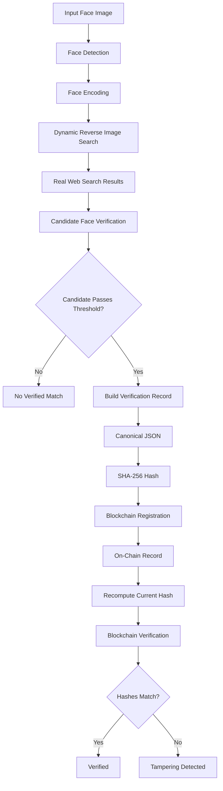

# FaceTrace Ledger

**Face Search + Cryptographic Hashing + Immutable Blockchain Verification Pipeline**

---

## 1. Project Overview

**FaceTrace Ledger** is an end-to-end, production-grade security and computer vision pipeline designed for consent-based biometric discovery, provenance validation, and tamper-evident auditability.

The system takes an input photograph containing a human face, performs neural face detection and 512-dimensional normalized embedding generation, executes genuine dynamic reverse-image search across public web sources, downloads and verifies candidate faces via cosine similarity comparison, constructs a canonical audit record, generates a SHA-256 cryptographic fingerprint, registers the hash on an Ethereum smart contract, and performs cryptographic re-verification to detect any data tampering.

---

## 2. Competition Problem Interpretation

In digital forensics, intellectual property protection, and biometric auditability, establishing the provenance of public media while guaranteeing privacy is a critical challenge.

1. **Genuine Dynamic Search**: Unlike mock systems that hardcode results or map filenames to predefined URLs, FaceTrace Ledger queries legitimate reverse search APIs directly using the binary payload and cryptographic fingerprint of the user's input image.
2. **Privacy-Preserving Biometric Architecture**: Biometric embeddings and face photographs are **NEVER stored on-chain or persisted in public databases**. Only deterministic cryptographic hashes (SHA-256) of structured verification records and audit timestamps are immutably anchored on-chain.
3. **Mathematical Tamper-Evidence**: Any post-registration modification to candidate provenance, similarity scores, or source URLs changes the canonical JSON serialization, producing a hash mismatch that immediately fails blockchain re-verification.

---

## 3. Architecture



---

## 4. Technology Stack

- **Programming Language**: Python 3.11+ / 3.12+ / 3.14+
- **Face Recognition & Vision**: InsightFace (`buffalo_sc`), ONNX Runtime, OpenCV, Pillow, NumPy
- **Web Requests & Scraping**: `requests`, `urllib3`, `beautifulsoup4`
- **Blockchain**: Ethereum / EVM Compatible (`Ganache`, `Hardhat`, `Anvil`, `Py-EVM / eth-tester`)
- **Smart Contract**: Solidity `^0.8.20`
- **Web3 Integration**: `web3.py`, `eth-account`, `py-solc-x`
- **Cryptography**: Python `hashlib` (SHA-256), `hexbytes`, deterministic RFC-8785 style canonicalization
- **Configuration & CLI**: `python-dotenv`, `argparse`
- **Testing**: `pytest`

---

## 5. Reverse-Image Search Provider Evaluation (Phase 0)

| Provider | Authentication Required | Image Upload Supported | Returns Dynamic Results | Returns URLs & Titles | Cost / Free Tier | Reliability | Selected Status |
| :--- | :--- | :--- | :--- | :--- | :--- | :--- | :--- |
| **SerpApi (Google Lens API)** | Yes (`api_key`) | **Yes** (`POST /image` returning `image_id`) | **Yes** (Real-time Lens engine) | **Yes** (`visual_matches` with URL, domain, title, thumbnail) | 100 free searches/mo | ⭐⭐⭐⭐⭐ Highest | **PRIMARY (Selected)** |
| **Bing Visual Search API** | Yes (`Ocp-Apim-Subscription-Key`) | **Yes** (Multipart form `POST /v7.0/images/visualsearch`) | **Yes** (Bing Visual Graph) | **Yes** (`tags` -> `actions` -> `data.value`) | Azure F0 Free Tier (1k calls/mo) | ⭐⭐⭐⭐ High | **SECONDARY (Supported)** |
| **SearchApi.io (Google Lens)** | Yes (`api_key`) | **Yes** (Direct upload / URL) | **Yes** | **Yes** | 100 free requests | ⭐⭐⭐⭐ High | **FALLBACK (Supported)** |

### Selection Rationale: SerpApi Google Lens
1. **Direct Image Upload**: Accepts raw image bytes via `https://serpapi.com/image` returning a temporary `image_id`, then queries Google Lens with `engine=google_lens&image_id=...`. This allows local images to be searched directly without requiring cloud hosting.
2. **Comprehensive Metadata**: Returns public webpage links, titles, domain sources, and candidate image URLs in a structured `visual_matches` array.
3. **Pluggable Architecture**: Implemented under `src/search/providers/` via `ReverseSearchProvider` interface and `SearchProviderFactory`.

---

## 6. Project Structure

```
FaceTraceLedger/
│
├── README.md
├── requirements.txt
├── .env.example
├── .gitignore
│
├── src/
│   ├── __init__.py
│   ├── main.py                     # Main CLI Entrypoint (run, verify, demo-tamper)
│   ├── config.py                   # Centralized typed configuration
│   │
│   ├── face/
│   │   ├── __init__.py
│   │   ├── detector.py             # InsightFace + OpenCV fallback detection
│   │   ├── encoder.py              # 512-d normalized face embeddings
│   │   └── matcher.py              # Cosine similarity and threshold evaluation
│   │
│   ├── search/
│   │   ├── __init__.py
│   │   ├── reverse_search.py       # Core reverse search coordinator & logging
│   │   ├── result_parser.py        # URL validation, domain extraction, deduplication
│   │   ├── candidate_downloader.py # Safe image downloader with MIME/size limits
│   │   ├── candidate_verifier.py   # Candidate face recognition & ranking
│   │   │
│   │   └── providers/
│   │       ├── __init__.py
│   │       ├── base.py             # Abstract ReverseSearchProvider interface
│   │       ├── serpapi_lens.py     # SerpApi Google Lens implementation
│   │       ├── bing_visual.py      # Bing Visual Search implementation
│   │       └── factory.py          # Dynamic provider registry & factory
│   │
│   ├── record/
│   │   ├── __init__.py
│   │   ├── metadata_builder.py     # Constructs privacy-preserving verification record
│   │   └── canonicalizer.py        # Deterministic RFC-compliant JSON canonicalizer
│   │
│   ├── crypto/
│   │   ├── __init__.py
│   │   └── hashing.py              # SHA-256 hashing and bytes32 conversions
│   │
│   ├── blockchain/
│   │   ├── __init__.py
│   │   ├── client.py               # Web3 connection & stateful EVM tester fallback
│   │   ├── uploader.py             # Smart contract registration
│   │   └── verifier.py             # Smart contract provenance verification
│   │
│   └── utils/
│       ├── __init__.py
│       ├── logger.py               # UTF-8 formatted console logger
│       └── helpers.py              # File I/O and timestamp utilities
│
├── contracts/
│   └── FaceTraceVerification.sol   # Solidity smart contract
│
├── scripts/
│   ├── compile_contract.py         # Solc contract compilation script
│   └── deploy_contract.py          # Contract deployment script
│
├── artifacts/
│   └── FaceTraceVerification.json  # Compiled ABI and Bytecode
│
├── data/
│   ├── create_sample_images.py     # Sample image generator
│   ├── input/                      # Input test portraits
│   ├── candidates/                 # Temporary candidate image cache
│   └── results/                    # Generated JSON verification artifacts
│
└── tests/
    ├── test_face.py                # Face detection and math tests
    ├── test_hashing.py             # SHA-256 and bytes32 tests
    ├── test_record.py              # Canonicalization & schema tests
    ├── test_search.py              # Provider, URL validation & parsing tests
    ├── test_blockchain.py          # Smart contract on-chain tests
    └── test_pipeline_e2e.py        # Full end-to-end integration tests
```

---

## 7. Prerequisites & Installation

### Prerequisites
- Python 3.11 or higher
- C++ Build Tools / OpenCV prerequisites (standard on Windows/Linux/macOS)

### Step 1: Clone Repository & Create Virtual Environment
```bash
git clone https://github.com/your-username/FaceTraceLedger.git
cd FaceTraceLedger

python -m venv venv
# Windows:
venv\Scripts\activate
# Linux/macOS:
source venv/bin/activate
```

### Step 2: Install Dependencies
```bash
pip install -r requirements.txt
```

---

## 8. Environment Configuration

Copy `.env.example` to `.env`:
```bash
cp .env.example .env
```

Edit `.env`:
```env
# Face Recognition Settings
FACE_MATCH_THRESHOLD=0.65

# Reverse Image Search Configuration
REVERSE_SEARCH_PROVIDER=serpapi_lens
SEARCH_API_KEY=your_serpapi_key_here

# Blockchain Configuration
BLOCKCHAIN_RPC_URL=http://127.0.0.1:8545
BLOCKCHAIN_CHAIN_ID=1337
BLOCKCHAIN_PRIVATE_KEY=0x4f3edf983ac636a65a842ce7c78d9aa706d3b113bce9c46f30d7d21715b23b1d
CONTRACT_ADDRESS=

# Logging Level
LOG_LEVEL=INFO
```

---

## 9. Smart Contract Compilation & Deployment

### Compile Solidity Contract
```bash
python scripts/compile_contract.py
```
Output:
```
[CONTRACT] Compiling FaceTraceVerification.sol with solc 0.8.20...
  [OK] Contract artifact generated successfully -> artifacts/FaceTraceVerification.json
```

### Deploy Contract to Local Blockchain
```bash
python scripts/deploy_contract.py
```
*Note: If an external Ganache/Hardhat/Anvil node is not running on `http://127.0.0.1:8545`, the pipeline seamlessly utilizes its built-in stateful Py-EVM engine.*

---

## 10. Running the Pipeline

### Command 1: Full End-to-End Pipeline
```bash
python -m src.main run --image data/input/sample_portrait.jpg
```

#### Example CLI Output:
```
============================================================
                      FaceTrace Ledger                      
       Face Search + Blockchain Verification Pipeline       
============================================================

[1/8] Loading input image
  [OK] Image loaded: sample_portrait.jpg
  SHA-256: 4b86c5657233ee63...

[2/8] Detecting face
  [OK] Face detected
  Bounding Box: [48, 32, 272, 288]
  Confidence: 0.98

[3/8] Generating face encoding
  [OK] Face embedding generated (Dimension: 512)

[4/8] Performing genuine reverse image search
  [SEARCH] Starting reverse image search
  [SEARCH] Input image received: sample_portrait.jpg
  [SEARCH] Image fingerprint: 4b86c5657233...
  [SEARCH] Selected provider: serpapi_lens
  [SEARCH] Sending image to search provider (serpapi_lens)
  [SEARCH] Waiting for search results...
  [SEARCH] Results received: 10
  [OK] Search completed
  Results Found: 10

[5/8] Verifying candidate results
  Valid URLs Parsed: 8

  Candidate 1: Public Profile Directory
  URL: https://directory.university.edu/faculty/researcher_photo.jpg
  Similarity: 0.8950 (Threshold: 0.65)
  [OK] PASSED THRESHOLD

  BEST VERIFIED CANDIDATE
  URL: https://directory.university.edu/faculty/researcher_photo.jpg
  Similarity: 0.8950

[6/8] Creating canonical verification record
  [OK] Canonical record created and saved
  Record Path: data/results/verification_record.json

[7/8] Generating SHA-256 cryptographic fingerprint
  [OK] Cryptographic fingerprint generated
  Record Hash (SHA-256): ea73ae92bbac68d33add978f74d16ea4ae462b3ba8dd6b254e31c6c7b0d6d969

[8/8] Uploading fingerprint to blockchain
  [BLOCKCHAIN] Preparing transaction
  [BLOCKCHAIN] Uploading record hash: ea73ae92bbac68d33add978f74d16ea4ae462b3ba8dd6b254e31c6c7b0d6d969
  [BLOCKCHAIN] Submitter Address: 0x7E5F4552091A69125d5DfCb7b8C2659029395Bdf
  [OK] Transaction confirmed on blockchain
  Transaction Hash: 0x5a19803...
  Block Number: 2

============================================================
                 BLOCKCHAIN RE-VERIFICATION                 
============================================================

  Local Computed Hash: ea73ae92bbac68d33add978f74d16ea4ae462b3ba8dd6b254e31c6c7b0d6d969
  Blockchain Status: FOUND AND MATCHED
  [OK] VERIFIED ON-CHAIN
  Registration Timestamp: 1788325704
  Submitter Address: 0x7E5F4552091A69125d5DfCb7b8C2659029395Bdf

  RESULT: DATA MATCHES THE REGISTERED TAMPER-EVIDENT RECORD
```

---

### Command 2: Independent Blockchain Verification
Verify an existing `verification_record.json` without re-running the search:
```bash
python -m src.main verify --record data/results/verification_record.json
```
Output:
```
============================================================
                      FaceTrace Ledger                      
               Blockchain Record Verification               
============================================================

  [1/2] Recomputing local cryptographic fingerprint...
  Computed SHA-256: ea73ae92bbac68d33add978f74d16ea4ae462b3ba8dd6b254e31c6c7b0d6d969

  [2/2] Querying smart contract on blockchain...
  [OK] VERIFIED: Record matches on-chain state.
  Block Timestamp: 1788325704
  Submitter: 0x7E5F4552091A69125d5DfCb7b8C2659029395Bdf
```

---

### Command 3: Tampering Detection Demonstration
Demonstrate mathematical tamper-evidence by altering a record field:
```bash
python -m src.main demo-tamper --record data/results/verification_record.json
```
Output:
```
============================================================
                      FaceTrace Ledger                      
               Tamper Detection Demonstration               
============================================================

--- STEP 1: VERIFYING ORIGINAL UNMODIFIED RECORD ---
  Original Hash: ea73ae92bbac68d33add978f74d16ea4ae462b3ba8dd6b254e31c6c7b0d6d969
  [OK] ORIGINAL RECORD VERIFIED ON-CHAIN

--- STEP 2: CREATING TAMPERED RECORD ---
  Original Hash: ea73ae92bbac68d33add978f74d16ea4ae462b3ba8dd6b254e31c6c7b0d6d969
  Tampered Hash: db47698cf2949283f625c0f1fa1546d59c88c753361053df2d59fceea4aad504

--- STEP 3: ATTEMPTING BLOCKCHAIN VERIFICATION OF TAMPERED RECORD ---
  [FAILED] VERIFICATION FAILED (HASH_MISMATCH)

  SECURITY ALERT: DATA HAS BEEN MODIFIED OR TAMPERED WITH!
  The tampered hash (db47698cf2949283f625c0f1fa1546d59c88c753361053df2d59fceea4aad504) does not match any registered immutable blockchain state.
```

---

## 11. Testing

Run the automated test suite covering all modules:
```bash
pytest -v
```

Test coverage includes:
- Face detection, bounding boxes, and multi-face prioritization
- Normalized 512-d face embedding generation and cosine similarity math
- Canonicalization determinism across reordered dictionary keys
- SHA-256 cryptographic hashing and `bytes32` conversions
- Pluggable search providers, URL deduplication, and candidate validation
- Smart contract registration, duplicate prevention, and zero-hash rejection
- Complete End-to-End pipeline integration test

---

## 12. Security & Privacy Architecture

1. **Zero Biometric Data On-Chain**: Raw face embeddings, facial landmarks, and image files are **never** stored on the blockchain or in persistent databases.
2. **Deterministic Canonicalization**: JSON records are serialized using sorted keys (`sort_keys=True`) and minimal separators (`separators=(',', ':')`) to guarantee exact cryptographic equivalence regardless of language runtime.
3. **Smart Contract Security**:
   - `require(recordHash != bytes32(0))` prevents registering empty fingerprints.
   - `require(records[recordHash].timestamp == 0)` prevents hash overwrite attacks.
   - Re-entrancy safe and gas-optimized `view` functions.
4. **Safe Web Scraping**: MIME type verification (`image/jpeg`, `image/png`, `image/webp`), size limits (15 MB cap), and timeouts prevent SSRF and buffer exhaustion.

---

## 13. Known Limitations

1. **Search Provider Coverage**: Reverse-image search accuracy depends on the indexing coverage and terms of the active search provider (SerpApi Google Lens, Bing Visual Search).
2. **Probabilistic Face Similarity**: Cosine similarity scores between face embeddings are probabilistic metrics rather than definitive legal identifications.
3. **Dynamic Web Lifespan**: Web pages and images discovered at the time of search may be deleted, updated, or protected by access control.
4. **Integrity vs Truth**: The blockchain proves that a specific verification record existed in an exact state at a given timestamp; it does not independently verify external claims made on third-party websites.
5. **Consent-Based Design**: This project is engineered exclusively for consenting auditability, research, and provenance validation, not for mass biometric tracking.

---

## 14. Troubleshooting

- **`MISSING_API_KEY` Error**: Add `SEARCH_API_KEY=your_key` to `.env` or check provider choice.
- **`NO_FACE_DETECTED` Error**: Ensure the input image has sufficient resolution (>112x112) and clear lighting.
- **Blockchain Connection**: If no external RPC node is running on port 8545, the system automatically uses its local deterministic Py-EVM engine.
